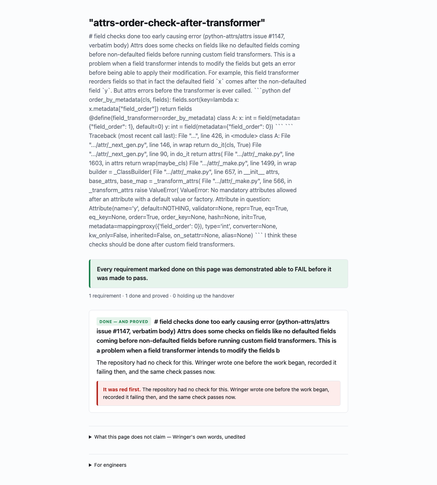

# wringer-board

**One page that tells you what is actually done — and shows you the proof.**

You asked for some things to be built. Something built them. This page tells
you, per requirement, whether it is done, and for every requirement marked done
it shows you the same check *failing* before the work happened.

That last part is the whole point. A green tick tells you a check passed. It
does not tell you the check could ever have failed — and a check that cannot
fail is not evidence, it is decoration. So every "done" on this page carries the
record of the same check being red first, and if that record cannot be produced,
the page says so instead of claiming it.



*A real page, not a mock-up — rendered from bundles a real run wrote, and
committed beside its own HTML in [`docs/captures/`](docs/captures/). The
[second capture there](docs/captures/board-uncovered-2026-08-16.png) is the one
worth more: the same board on a day the evidence was not there, with the
promise withheld.*

**No PyPI release, and this line says so rather than telling you to install
something that does not exist.** The source is public at
[github.com/marcoakes/wringer-board](https://github.com/marcoakes/wringer-board)
and a page rendered by this code is live at
<https://marcoakes.github.io/wringer-board/>. What does not exist is a PyPI
release, so today the only way to *run* it is from a clone:

```bash
pip install -e .
wringer-board render /path/to/your/repo -o board.html
open board.html
```

Once there is a release, the first line becomes `pip install wringer-board`
and nothing else about the command changes.

One HTML file. No server, no account, no network. It reads the evidence
[Wringer](https://github.com/marcoakes/wringer) already wrote into your
repository and renders it; it never re-decides anything.

---


> ### 👉 Are you a product manager rather than an engineer?
>
> There is a five-step guide that starts from nothing and ends with a page
> showing what was built and what proves it:
> [**wringer-drive/START-HERE.md**](https://github.com/marcoakes/wringer-drive/blob/main/START-HERE.md)

## What each card can say

| | |
|---|---|
| **DONE — AND PROVED** | The check for this passes — and the same check is on the record having failed. |
| **NOT YET** | Not done — and the check that decides it is written and failing right now. |
| **NOT REACHED** | Not checked in this run, so nothing here says anything about it. |
| **NEEDS YOU** | A person has to decide this one, and the page says which of the five reasons applies. |
| **UNKNOWN** | This record says something the board does not understand, so it is showing nothing rather than something it cannot stand behind. |
| **UNTRANSLATED** | Wringer said something the board has no plain-English wording for yet, so you get Wringer's own words, verbatim. |

**REFUSED** is a badge rather than a state, and it can appear on several of the
above. That is deliberate: it is the *handover* that was refused, not the
requirement.

## What happened in this round

Above the cards, the page says in the same plain language what else the run
recorded: how the work stopped, whether the checks noticed the change at all,
whether the checks still look capable of failing, what an audit found, and how
a supervised queue of work ended.

**Only what was actually measured appears there.** No signature check, and the
page says nothing about signatures — it does not say "unsigned". No fleet, and
nothing about fleets. A thing nobody measured and a thing that came back bad
are different facts, and this page will not render one as the other.

Two of those come from commands rather than from files, because Wringer does
not write them into your repository — so you hand the board its own reports:

```bash
wring health --json --output health.json
wring audit --json .wringer/attestations/<id>/attestation.json > audit.json
wringer-board render . --health-report health.json --audit-report audit.json
```

Without them the page simply says nothing about those things, which is the
point.

## What this page will not do

- It will not soften, hide, dismiss or auto-resolve a refusal. There is no
  "proceed anyway" button and there is no code path that catches a refusal and
  carries on.
- It will not translate Wringer's own stated limits into friendlier language. A
  translated limit is a weakened limit, so they render verbatim.
- It will not score, rank, or grade anything, or judge whether a change is good.
- If it meets a record written in a format it does not know, it renders **no
  cards at all** and tells you the version — rather than guessing and showing
  you something that might be wrong.

## The honest ceiling, said here rather than buried

A check that was demonstrated able to fail, and then made to pass, is real
evidence and it is much better than a check that has only ever been green. **It
is not a guarantee that the work is right.** A check proves the thing it
checks; where the requirement was written vaguely, the check inherits that
vagueness. Nothing on this page claims otherwise, and nothing here catches a
change that satisfies the requirement as written and is still wrong.

Apache-2.0, same as the engine.
